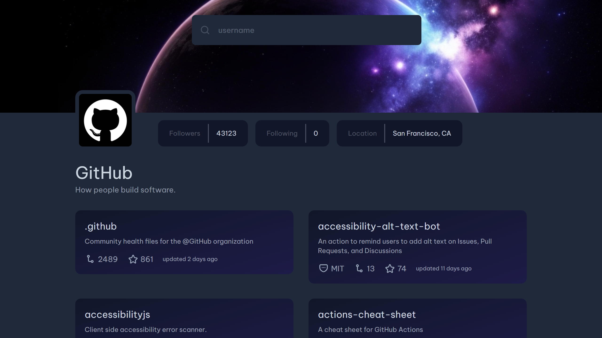

# Github Profile App

This is a solution to the [Github profile challenge on DevChallenges.io](devchallenges.io). DevChallenges.io help you improve your coding skills by building realistic projects.

## Table of contents

- [Overview](#overview)
  - [The challenge](#the-challenge)
  - [Screenshot](#screenshot)
  - [Links](#links)
- [My process](#my-process)
  - [Built with](#built-with)
  - [Useful resources](#useful-resources)
- [Author](#author)

## Overview

Use Typescript, React, Vite, TailwindCSS as a technology stack. One of the main difficulties I encountered was how to make the search bar, since I had to make an HTTP request to the Github API (octokit) every time something was written in the input; The other difficulty I encountered was how to manage the state of the application, what best suited this situation was to use React's Context API.

### The challenge

The challenge requires creating a Github Profile search application that utilizes multiple API endpoints. The Github Profile search app requires the use of multiple APIs, such as the Github REST API, which returns information about a repository as a JSON.

### Screenshot

### Links

- [Solution URL](https://devchallenges.io/solution/15169)
- [Live Site URL](https://codingleonardo.github.io/github-profile/)

## My process

### Built with

- [Typescript](https://www.typescriptlang.org/) - Superset of JavaScript which adds static typing
- [React](https://reactjs.org/) - JS library
- [Tailwind CSS](https://tailwindcss.com/) - CSS library
- [Octokit](https://github.com/octokit/octokit.js) - SDK Github for Node.js

### Useful resources

- [MDN Web Docs](https://developer.mozilla.org/en-US/docs/Web/CSS) - This helped me learn how filters work in css.

## Author

- Website - [Leonardo Rivero](https://codingleonardo.github.io/)
- DevChallenges.io - [@CodingLeonardo](https://devchallenges.io/profile/8c0bdef8-0f64-4c92-8640-bcae8d05fb4b)
- Twitter - [@CodingLeonardo](https://www.twitter.com/CodingLeonardo)
